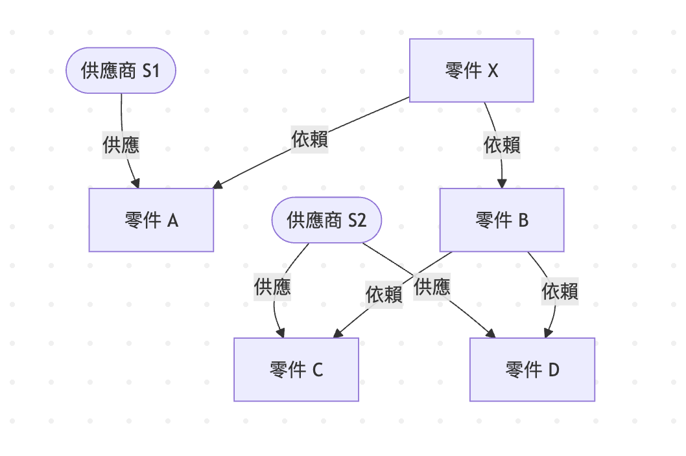
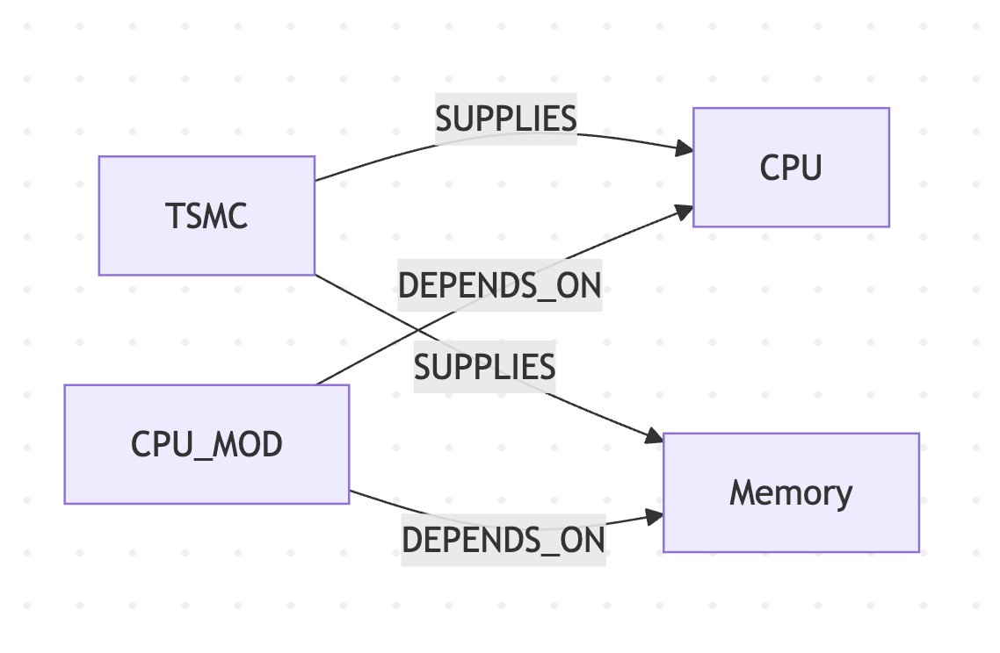
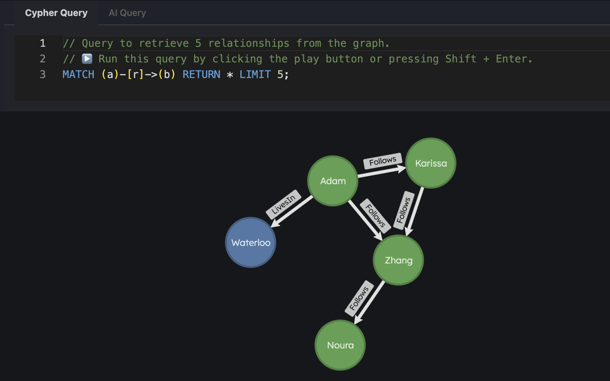

<!-- _class: lead -->

# Graph 是什麼？
# 為什麼不用 SQL / Python 就好

**Unit 1** | Graph Analysis Workshop

---

# 三個問題，先問清楚

今天先不急著教語法

1. **為什麼要用 Graph 建模？**
2. **用 Graph 建模之後，有哪些選擇？**
3. **為什麼選 Cypher + Ladybug？**

---

# Q1：為什麼要用 Graph 建模？

**具體情景：Supply chain 的 BOM**



**你要解的問題**：零件 X 要生產，依賴哪些上游供應商？如果其中一個斷料，風險在哪裡？

在 supply chain 的情境，「依賴」（邊）就是分析的主角。

---

# Q1：關係是一等公民

| RDBMS | Graph DB |
|-------|----------|
| 關係 = 外鍵 | 關係 = 一等公民 |
| 關係是隱式的 | 關係是顯式的 |
| 多跳 = 多層 JOIN | 多跳 = 沿邊走 |

**演算法橋接**：
「找出所有上游依賴」是一個 graph traversal 問題，BFS / DFS 都可以解

---

# Q2：有哪些選擇？

**三種做 graph traversal 的方法，各有 trade-off**

| 架構 | 實作 | 代價 |
|------|------|------|
| Application Layer | Python + NetworkX | 需要搬移大量資料 |
| RDBMS + recursive CTE | SQL WITH RECURSIVE | SQL RECURSIVE Query 難寫難讀 |
| Graph DB | Cypher Query | Cypher 相對冷門。 |

**沒有絕對的對錯，但有適合的情境**

---

# Q2：什麼情況選哪個？

**選 Application layer**：資料量小、一次性分析、原型驗證

**選 RDBMS + CTE**：層數不深（1–3 跳）且不需要複雜的 graph algorithms

**選 Graph DB**：
- 多跳查詢是常態（3 跳以上）
- 關係本身要存屬性
- 資料量大，需要 in-database analytics

---

# Q3：為什麼選 Cypher + Ladybug？

**Cypher：query 的結構長得像你要找的圖**

```cypher
(a:Component)-[:DEPENDS_ON]->(b:Component)
```

你看到的形狀，就是你要查的結構——語法反映語意。

---

# Q3：Ladybug 的定位

- **Embedded**：跑在你的 process 裡，不需要起 server
- **Columnar**：columnar storage，分析查詢快
- **MIT License**：開源，可商用

```bash
# 安裝
brew install ladybug
# 或
curl -fsSL https://install.ladybugdb.com | sh
```

---

# 元素 #1：節點（Node）

**節點 = 有獨立身份的實體**

```
  ┌─────────────────────────┐
  │        Component        │  ← Label（類型）
  ├─────────────────────────┤
  │  name:     "CPU"        │  ← Properties
  │  critical: true         │
  └─────────────────────────┘

  ┌─────────────────────────┐
  │        Supplier         │
  ├─────────────────────────┤
  │  name:    "TSMC"        │
  │  country: "TW"          │
  └─────────────────────────┘
```

---

# 元素 #2：關係（Relationship）

**關係 = 有方向、有類型的連接，本身也可以有屬性**

```
  ┌──────────┐                      ┌──────────┐
  │  TSMC    │ ──── SUPPLIES ──────► │  CPU     │
  └──────────┘   lead_time: 30      └──────────┘

  ┌──────────┐                      ┌──────────┐
  │ CPU_MOD  │ ── DEPENDS_ON ──────► │  CPU     │
  └──────────┘   quantity: 1        └──────────┘
```

關係不是 JOIN 之後才出現的，它是一等公民——有名字、有方向、有屬性。

---

# 元素 #3：把它們組合起來

**一個小型 Supply chain graph 長這樣：**



節點 = 圓框，關係 = 箭頭，屬性 = 貼在上面的標籤

---

# Modeling 思考：什麼該是節點？關係？

**判斷原則**

| 應該是節點 | 應該是關係 |
|-----------|-----------|
| 有獨立身份，在多個地方被參照 | 描述兩個實體之間「發生了什麼」 |
| 有多個屬性要存 | 可以用動詞描述（DEPENDS_ON、SUPPLIES） |
| 未來可能有更多連接 | 本身不需要被其他東西「指向」 |

**Supply chain 示範**：
- `Component` → 節點（被多個人依賴、有名稱/屬性）
- `DEPENDS_ON` → 關係（描述零件之間「依賴」這件事）
- `quantity: 2` → 關係上的屬性（這個依賴需要幾個）

---

# Basic Cypher Syntax

**四個最常用的 clause：**

```cypher
MATCH  (n:Label {property: value})-[:TYPE]->(m)   -- 找符合的 pattern
WHERE  n.property > 10                             -- 進一步過濾
RETURN n.name, m.name                              -- 選擇輸出
LIMIT  10                                          -- 限制筆數
```

**建立資料：**

```cypher
CREATE (c:Component {name: 'CPU', critical: true})
CREATE (s:Supplier  {name: 'TSMC'})
CREATE (s)-[:SUPPLIES {lead_time: 30}]->(c)
```

**語法直覺**：MATCH 的 pattern 就是你要找的圖的形狀。

---

# 今天的 Dataset：Supply Chain BOM

```
Supplier S1 ──SUPPLIES──► Component A  (lead_time: 14)
Supplier S1 ──SUPPLIES──► Component D  (lead_time: 30)
Supplier S2 ──SUPPLIES──► Component B  (lead_time: 21)
Supplier S2 ──SUPPLIES──► Component C  (lead_time:  7)
Supplier S2 ──SUPPLIES──► Component E  (lead_time: 14)

Component X ──DEPENDS_ON──► Component A  (quantity: 1)
Component X ──DEPENDS_ON──► Component B  (quantity: 2)
Component X ──DEPENDS_ON──► Component E  (quantity: 1)
Component B ──DEPENDS_ON──► Component C  (quantity: 4)
Component B ──DEPENDS_ON──► Component D  (quantity: 1)
Component A ──DEPENDS_ON──► Component C  (quantity: 2)
Component E ──DEPENDS_ON──► Component D  (quantity: 1)
```

8 個節點，12 條邊。https://github.com/humorless/sciwork/blob/main/supply-chain.cypher

---

# 路線圖：今天四個 Unit

| Unit | 主題 | 關鍵問題 |
|------|------|----------|
| **1（現在）** | Graph 基礎 | 為什麼用 Graph？怎麼建模？|
| 2 | Cypher | 怎麼寫多跳查詢？|
| 3 | In-database 計算 | 讓 DB 跑演算法 |
| 4 | 可解釋性 | 路徑就是解釋 |

貫穿主軸：**機器跑得動、人看得懂**

---

<!-- _class: lead -->

# 實作開始！

---

# 實作目標（30 min）

**你會完成：**

1. ✅ 熟悉 Ladybug Explorer 介面
2. ✅ 用 CLI 建立資料庫並載入 Supply Chain dataset
3. ✅ 用 Explorer 連上自己的資料庫
4. ✅ 跑出第一個 query

---

# Step 1（5 min）：認識 Ladybug Explorer

```bash
docker run -p 8000:8000 --rm ghcr.io/ladybugdb/explorer:latest
```

開啟瀏覽器，連上 `http://localhost:8000`

點選左邊的 **Import**，選 **Try a Sample Dataset**，並且探索 Explorer 介面

---



---

# Step 2（5 min）：建立資料庫並載入資料

```bash
lbug unit-1.lbug < supply-chain.cypher
```

---

# Step 3（5 min）：用 Explorer 連上自己的資料庫

```bash
docker run -p 8000:8000 \
  -v $(pwd):/database \
  -e LBUG_FILE=unit-1.lbug \
  --rm ghcr.io/ladybugdb/explorer:latest
```

切換到 **Schema panel** 確認：

- 出現 `Component`、`Supplier` 兩種節點 ✓
- 出現 `SUPPLIES`、`DEPENDS_ON` 兩種關係 ✓

---

# Step 4（15 min）：跑第一個 Query

```cypher
-- Query 1：列出所有零件
MATCH (c:Component)
RETURN c.name, c.critical
```

```cypher
-- Query 2：誰供應什麼？
MATCH (s:Supplier)-[:SUPPLIES]->(c:Component)
RETURN s.name, c.name
```

```cypher
-- Query 3：第一跳依賴
MATCH (a:Component)-[:DEPENDS_ON]->(b:Component)
RETURN a.name, b.name
```

✅ 看到結果 → 成功！　❌ 出錯 → 舉手

---

# 檢查點

Query 3 的結果應該像這樣：

```
a.name    b.name
────────  ────────
X         A
X         B
X         E
A         C
B         C
B         D
E         D
```

**你剛才做了什麼**：
- 載入了一個 graph
- 用 Cypher 走了第一跳關係


